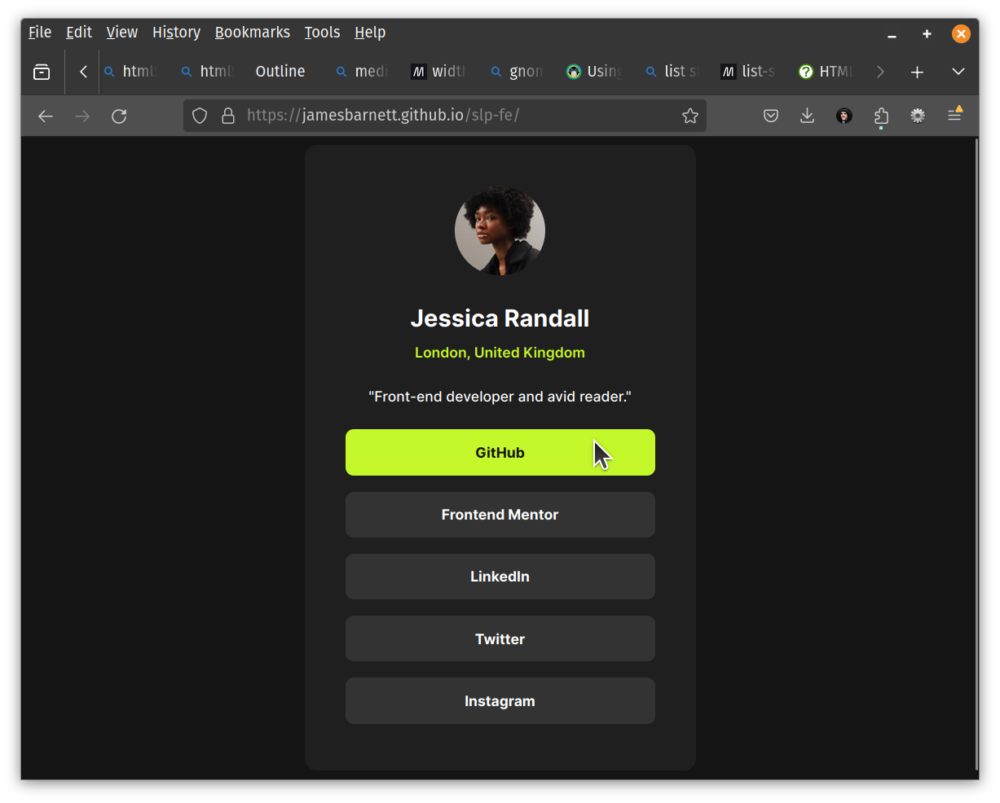

# Frontend Mentor - Social links profile solution

This is a solution to the [Social links profile challenge on Frontend Mentor](https://www.frontendmentor.io/challenges/social-links-profile-UG32l9m6dQ). Frontend Mentor challenges help you improve your coding skills by building realistic projects. 

## Table of contents

- [Overview](#overview)
  - [The challenge](#the-challenge)
  - [Screenshot](#screenshot)
  - [Links](#links)
- [My process](#my-process)
  - [Built with](#built-with)
  - [What I learned](#what-i-learned)
  - [Continued development](#continued-development)
  - [Useful resources](#useful-resources)
- [Author](#author)

## Overview

### The challenge

Users should be able to:

- See hover and focus states for all interactive elements on the page

### Screenshot

### Links

- Solution URL: [GitHub Repo](https://github.com/jamesbarnett/slp-fe)
- Live Site URL: [GitHub Page](https://jamesbarnett.github.io/slp-fe/)

## My process

### Built with

- Semantic HTML5 markup
- CSS custom properties
- CSS Grid
- Vite
- Font Squirrel
- woff2_compress
- formiko (for markdown files)

### What I learned

- Self-hosting fonts
- Converting OTP fonts to woff2 with `woff2_compress`
- Default margin/padding values for `<ul>` elements

### Continued development

- Improving markup structure for accessibility
- Deliberate and methodical choices for margins and paddings

### Useful resources

- [Font Squirrel](https://www.fontsquirrel.com/) - This helped me for XYZ reason. I really liked this pattern and will use it going forward.

## Author

- Frontend Mentor - [@jamesbarnett](https://www.frontendmentor.io/profile/jamesbarnett)
